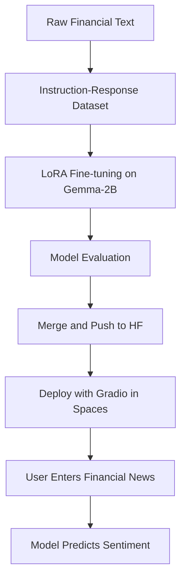

# 💸 Finetuned LLM for Financial Sentiment Analysis using Gemma-2B + LoRA

> 🚀 An end-to-end project where a 2-billion-parameter language model (Gemma-2B) is fine-tuned on financial sentiment data using LoRA and deployed on Hugging Face Spaces with an intuitive Gradio UI.

---

## 🧠 Introduction

In financial markets, **sentiment matters** — from central bank statements to earnings announcements, the tone of the language can move markets. This project builds a **language model that reads financial news and classifies the sentiment** into **positive, neutral, or negative**.

Built with Hugging Face’s `transformers`, Google's `Gemma`, and parameter-efficient fine-tuning (LoRA), this model is designed for **cost-effective training and real-time inference**.

---

## 📚 Background

### 📌 What is Gemma?

> **Gemma-2B** is a lightweight yet powerful large language model (LLM) from Google optimized for conversational tasks and reasoning. With 2 billion parameters, it's ideal for fine-tuning and on-device inference.

### 🛠 What We Did

- Used **LoRA (Low-Rank Adaptation)** to fine-tune only a fraction of model parameters.
- Trained on custom sentiment-labelled financial text using a prompt-based format.
- Merged adapter weights and pushed the full model to [🤗 Hugging Face Hub](https://huggingface.co).
- Deployed an interactive Gradio app on Hugging Face Spaces.

---

## 🧰 Tools & Technologies Used

| Tool / Platform            | Purpose                              |
|---------------------------|--------------------------------------|
| 🐍 Python                 | Core programming language            |
| 🧠 Google Gemma-2B Model | Base LLM                             |
| 💻 Vertex AI Workbench    | Training & compute                   |
| 📓 Google Colab           | Data exploration, pretraining setup  |
| 🤗 Hugging Face Hub       | Model hosting and sharing            |
| 🎛 Gradio                 | Web UI for text input and sentiment  |

---

## 🖼 Deployed UI Snapshot

 <!-- Replace this with actual hosted screenshot if needed -->

🔗 **Live Demo**: [Click here to try the app](https://huggingface.co/spaces/dushyant22/Financial_Sentiment_Analysis)

---

## 📈 Project Workflow

---

## 🚀 Potential Applications

This model can serve a variety of high-impact real-world use cases in finance and fintech:

### 🧠 Investment Intelligence
- Automatically analyze news feeds and flag sentiment-shifting events that impact stock prices.

### 🏦 Banking & Risk Analytics
- Monitor central bank speeches, financial reports, or client communication for risk signals.

### 📱 Fintech Apps
- Power mobile apps or chatbots with real-time financial news sentiment classification.

### 📰 Financial Media Monitoring
- Media firms can use this to track public company sentiment trends in press releases or news headlines.

### 📊 Trading Strategies
- Feed model outputs into algorithmic trading models that react to sentiment shifts.

---

## 🎓 What I Learned

This project was a hands-on opportunity to integrate multiple machine learning skills and DevOps practices:

### 🔍 Technical Learnings
- Applied **LoRA** to fine-tune a 2B parameter model with minimal compute.
- Understood how to build **prompt-response datasets** for instruction-tuned LLMs.
- Learned how to **merge LoRA adapters** and export a standalone model for deployment.

### 🛠 Engineering & Deployment
- Gained experience with **Gradio** for building NLP UIs.
- Used **Hugging Face Hub & Spaces** for publishing and hosting models and apps.
- Practiced evaluation techniques for generative models repurposed for **classification**.

---

## ✅ Conclusion

This project demonstrates that:

- Large language models like **Gemma-2B** can be adapted efficiently using LoRA.
- Even small datasets can yield useful models with the right prompt formatting and task framing.
- Open-source tools like Hugging Face and Gradio make it easy to **deploy and share powerful AI models**.

It was incredibly rewarding to build a **complete ML pipeline** — from data prep to training, evaluation, and deployment — for a domain as impactful as **financial sentiment analysis**.

---

🔗 [Run the App](https://huggingface.co/spaces/dushyant22/Financial_Sentiment_Analysis)  
📦 [View the Model](https://huggingface.co/dushyant22/Financial_Sentiment_Analysis)
